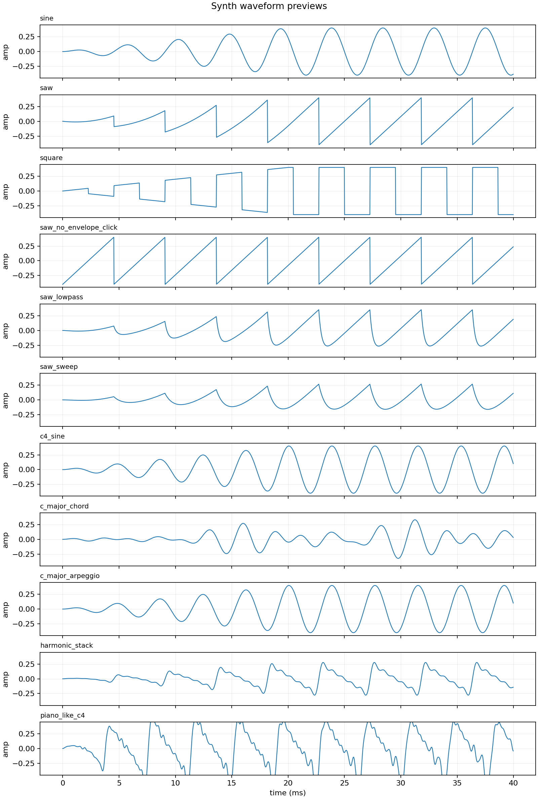

# 合成器介绍

## 合成器是什么

合成器，英文是 synthesizer，常简称 synth。它是一种用电子或数字方式生成声音的乐器或声音引擎。

传统乐器的声音来自真实物理振动：

- 吉他：琴弦振动。
- 钢琴：琴槌敲击琴弦。
- 小提琴：弓摩擦琴弦。
- 人声：声带振动。

合成器不是先录下这些声音再播放，而是用振荡器、滤波器、包络、调制等模块“造出声音”。它可以模仿传统乐器，也可以创造现实中没有的声音。

## 合成器、采样器、音源、插件的区别

这些词经常一起出现，但不是一回事。

| 术语 | 含义 |
| --- | --- |
| synthesizer / synth | 通过算法或电子电路生成声音。 |
| sampler | 播放、变调、加工预先录制的声音样本。 |
| sound module | 音源模块，可以是合成器、采样器或二者结合。 |
| virtual instrument | 运行在电脑里的虚拟乐器，可能是 synth，也可能是 sampler。 |
| plugin | 插件格式中的软件模块，例如 VST、AU、AAX、LV2；它可以是合成器、采样器或效果器。 |

例子：

```text
MIDI 键盘 -> 软件合成器插件 -> 合成声音 -> 音频输出
MIDI 键盘 -> 钢琴采样器插件 -> 播放钢琴采样 -> 音频输出
```

MIDI 只负责告诉乐器“什么时候弹什么音、力度多大、控制器怎么变化”。后面到底是合成器还是采样器，决定了声音如何产生。

## Synth 和 Sampler 的本质区别

Synth 和 sampler 最后都能输出音频，所以听起来可能都像“乐器”。区别在于声音来源。

### Synth：从规则生成声音

Synth 的声音来自算法或电路。它先生成基础波形，再通过滤波、包络、调制和效果器塑形。

```text
oscillator 生成 saw wave
  -> low-pass filter 削掉高频
  -> envelope 控制音量变化
  -> audio output
```

它的优势是参数可塑性强。你可以连续改变 cutoff、resonance、LFO、FM ratio 等参数，得到现实乐器没有的声音。

### Sampler：从录音样本播放声音

Sampler 的声音来自预先录制好的音频样本。例如录下真实钢琴每个键、不同力度、不同踏板状态，然后按 MIDI 触发相应样本。

```text
MIDI note 60, velocity 90
  -> 找到 C4、力度 90 附近的钢琴采样
  -> 播放这段录音
  -> audio output
```

它的优势是真实感。钢琴、管弦乐、鼓这类真实乐器，如果目标是像真实演奏，采样器通常更直接。

### 为什么它们能达到相似效果

因为最终听到的都是音频波形。只要输出波形相似，人耳就可能觉得相似。

但制作路径不同：

| 目标 | Synth 做法 | Sampler 做法 |
| --- | --- | --- |
| 钢琴声 | 用算法近似模拟琴弦和共鸣，很难逼真 | 播放真实钢琴采样，通常更真实 |
| 电子 bass | 用 oscillator/filter/envelope 直接塑造 | 可以播放采样，但可调空间较小 |
| 管弦乐 | 需要复杂物理建模或合成技巧 | 多层真实采样更常见 |
| 科幻音效 | 参数调制和波形设计很方便 | 也能用采样，但变化不如合成灵活 |

简单判断：

- 想要真实乐器质感：优先 sampler。
- 想要可设计、可调制、电子感强的声音：优先 synth。
- 现代虚拟乐器经常混合两者：采样作为声音材料，再用合成器式滤波、包络和调制加工。

## 合成器和 MIDI 的关系

MIDI 和合成器是天然搭档，但层次不同：

- MIDI 是控制协议。
- 合成器是声音生成器。

典型链路：

```text
Note On / CC / Pitch Bend
  -> synthesizer
  -> audio signal
```

常见控制关系：

- Note On：触发一个音。
- Note Off：释放一个音。
- Velocity：影响起音音量、亮度或力度响应。
- Pitch Bend：控制弯音。
- Mod Wheel / CC 1：常控制 vibrato、filter 或其他调制。
- Aftertouch：按键后压力，常控制音色变化。
- Program Change：切换预设音色。

所以同一段 MIDI 换不同合成器会完全变声，因为 MIDI 只提供演奏事件，声音由合成器决定。

## 合成器的核心模块

### Oscillator

Oscillator 是振荡器，负责产生原始波形。它相当于声音的起点。

常见波形：

- Sine wave：正弦波，声音纯净。
- Sawtooth wave：锯齿波，明亮，适合 lead、bass、pad。
- Square wave：方波，中空感强，常见于复古游戏音色。
- Triangle wave：三角波，比正弦波多一点泛音。
- Noise：噪声，常用于鼓、风声、特殊效果。

Example:

```text
A sawtooth oscillator through a low-pass filter is a classic synth bass starting point.
锯齿波振荡器经过低通滤波器，是经典合成器贝斯的起点。
```

## 用程序演示波形和滤波

最小演示不需要 MIDI，也不需要插件；直接用程序生成 PCM 音频即可。示例脚本在 [src/synth_wave_demo.py](../src/synth_wave_demo.py)。

脚本会生成一组 `.wav` 文件和一张波形对比图。下面这张图来自脚本生成的 `waveforms.png`：



生成文件和听感对比：

| 文件 | 内容 | 重点听什么 |
| --- | --- | --- |
| `sine.wav` | 220 Hz 正弦波单音 | 泛音少，最纯，像测试音。 |
| `saw.wav` | 220 Hz 锯齿波单音 | 泛音多，明亮、刺耳。 |
| `square.wav` | 220 Hz 方波单音 | 音高接近 220 Hz，但更空心、更电子。 |
| `saw_no_envelope_click.wav` | 没有包络的锯齿波 | 开头和结尾比 `saw.wav` 更突兀，可能有 click。 |
| `saw_lowpass.wav` | 锯齿波经过低通滤波器 | 比 `saw.wav` 暗，因为高频被滤掉。 |
| `saw_sweep.wav` | 低通 cutoff 从低到高扫动 | 从暗变亮，能听到滤波器打开。 |
| `c4_sine.wav` | C4 的正弦波单音 | 音高变成 C4，但音色仍是纯正弦。 |
| `c_major_chord.wav` | C4、E4、G4 同时响 | 三个频率同时叠加，听起来是和弦。 |
| `c_major_arpeggio.wav` | C4、E4、G4 依次响 | 三个音按时间展开，听起来是琶音。 |
| `harmonic_stack.wav` | 220 Hz 基频叠加多个泛音 | 音高接近 `sine.wav`，但音色更丰富。 |
| `piano_like_c4.wav` | 合成近似的类钢琴 C4 | 比 `c4_sine.wav` 更像敲击类乐器，但不是真实钢琴采样。 |

这就是最基础的 subtractive synthesis：先产生富含泛音的波形，再用滤波器削掉一部分频率。

### 这个脚本为什么能发出声音

电脑播放声音时，最终需要一串音频采样值。脚本做的事情就是生成这些采样值，并写成标准 `.wav` 文件。

核心链路：

```text
数学函数生成波形 sample
  -> render 生成 2 秒钟的 sample 列表
  -> write_wav 把 sample 写成 PCM WAV 文件
  -> 播放器/系统音频输出
  -> 扬声器振动
```

脚本里的关键常量：

```text
SAMPLE_RATE = 44100
DURATION = 2.0
FREQ = 220.0
```

含义：

- `SAMPLE_RATE = 44100`：每秒 44100 个采样点，这是常见 CD 采样率。
- `DURATION = 2.0`：每个音频文件长度是 2 秒。
- `FREQ = 220.0`：波形每秒振动 220 次，也就是 220 Hz。

220 Hz 是 A3。常见约定中 A4 是 440 Hz，C4 约是 261.63 Hz。所以这个脚本生成的不是钢琴上的 C4，而是一个 220 Hz 的 A 音高附近的单音。它也不是钢琴音色，因为没有钢琴琴槌、琴弦、共鸣箱和采样，只是合成波形。

### 频率和音乐音高怎么对应

固定频率的周期波形会被听成一个稳定音高。频率越高，音越高；频率越低，音越低。

常见十二平均律里，A4 定义为 440 Hz。其他音高可以用这个公式推出来：

```text
frequency = 440 * 2 ** ((midi_note - 69) / 12)
```

这个公式来自两个约定：

1. 八度关系：高一个八度，频率翻倍；低一个八度，频率减半。所以 A3 是 220 Hz，A4 是 440 Hz，A5 是 880 Hz。
2. 十二平均律：一个八度被平均分成 12 个半音，每个半音的频率比例相同。

如果 12 个半音之后频率要刚好翻倍，那么每个半音的比例 `r` 必须满足：

```text
r ** 12 = 2
r = 2 ** (1 / 12)
```

MIDI note 69 被约定为 A4，也就是 440 Hz。某个 MIDI note 和 69 差多少个半音，就把 440 乘上多少次 `2 ** (1 / 12)`：

```text
frequency = 440 * (2 ** (1 / 12)) ** (midi_note - 69)
          = 440 * 2 ** ((midi_note - 69) / 12)
```

例子：

| 音名 | MIDI note | 频率 |
| --- | --- | --- |
| A3 | 57 | 220.00 Hz |
| C4 | 60 | 261.63 Hz |
| E4 | 64 | 329.63 Hz |
| G4 | 67 | 392.00 Hz |
| A4 | 69 | 440.00 Hz |

所以，按一个固定 `frequency` 生成一段 sine，我们听到的就是一个稳定音高的单音。脚本里的 `c4_sine.wav` 用的是 C4 的频率；`sine.wav` 用的是 220 Hz，也就是 A3。

### 哪些频率能听到

健康年轻人常说的可听范围大约是 20 Hz 到 20000 Hz，但实际会因年龄、音量、设备和听力状态变化。

粗略理解：

- 20 Hz 以下：更多像震动，不容易听成明确音高。
- 20-80 Hz：很低的低频，常见于低音和鼓的身体感。
- 80-1000 Hz：很多乐器音高和人声主体在这里。
- 1000-5000 Hz：人耳很敏感，影响清晰度和存在感。
- 5000-20000 Hz：亮度、空气感、齿音、泛音细节。
- 20000 Hz 以上：多数人听不到，很多设备也不完整重放。

合成器里即使振荡器产生了很高的泛音，超过人耳或采样率可表达范围后也不能正常听到。数字音频还受 Nyquist 频率限制：采样率 44100 Hz 时，理论上最高只能表示 22050 Hz 以下的频率。

50 Hz 交流电本身不是“空气中的声音”，所以你不会直接听到电压。人能听到的是空气压力变化。220V/50Hz 交流电如果让某个设备的线圈、变压器铁芯、灯具外壳或扬声器发生机械振动，就可能听到 50 Hz 或 100 Hz 的嗡声。很多电器的 hum 就是这个原因。

所以：

- 50 Hz 作为空气振动，音量足够时可以听到，是很低的嗡声。
- 电线里 50 Hz 的电压变化，如果没有转成机械振动或扬声器运动，人耳听不到。
- 普通音响播放 50 Hz 正弦波时能听到或感到低频，但小手机/笔记本扬声器可能放不出来。

### `sine` 做什么

`sine(time)` 根据当前时间计算一个正弦波采样值：

```text
sin(2 * pi * frequency * time)
```

如果 `frequency = 220`，意思是一秒钟重复 220 次周期。正弦波只有基频，泛音极少，所以听起来很纯。

### `render` 做什么

`render(oscillator)` 把一个波形函数变成一整段声音。

它做三件事：

1. 根据 `DURATION` 和 `SAMPLE_RATE` 算出总采样点数。
2. 对每个采样点算出当前时间 `time`。
3. 调用 `oscillator(time)` 生成采样值，再乘上 `envelope` 避免开头和结尾爆音。

这是一个单音，不是多个音叠加。若要做和弦，可以同时生成多个频率的波形再相加，例如 C4、E4、G4 三个频率叠加就是 C 大三和弦的基础版本。

单音、和弦、琶音在代码里的差异：

- 单音：一个频率持续发声，例如 `c4_sine.wav`。
- 和弦：多个频率同时相加，例如 `c_major_chord.wav`。
- 琶音：多个频率按时间先后出现，例如 `c_major_arpeggio.wav`。

简单说，和弦是“横向同时叠加”，琶音是“纵向按时间展开”。

### `envelope` 做什么

`envelope(index, total)` 在这个脚本里只做一个简化包络：开头 0.02 秒从 0 渐强到正常音量，结尾 0.25 秒从正常音量渐弱到 0。

如果没有包络，波形可能在第一个 sample 突然从 0 跳到某个非零值，结尾也可能突然截断。这种不连续会产生很短的爆裂声或 click。

包络的作用是让声音边缘平滑：

```text
没有包络：突然开始 -> 持续 -> 突然结束
有包络：  渐入     -> 持续 -> 渐出
```

脚本里的 `saw_no_envelope_click.wav` 用来对比这个效果。它和 `saw.wav` 音高、波形都一样，但没有渐入渐出，更容易听到开头和结尾的突兀 click。

### `write_wav` 做什么

`write_wav(path, samples)` 把浮点采样值写成 WAV 文件。

脚本内部的 sample 是 `-1.0` 到 `1.0` 之间的浮点数；WAV 文件里使用 16-bit PCM，所以要转成 `-32768` 到 `32767` 附近的整数。

```text
float sample: -1.0 ... 1.0
PCM int16:    -32768 ... 32767
```

写入 WAV 文件时还会写入这些元数据：

- 单声道：`setnchannels(1)`。
- 16-bit：`setsampwidth(2)`，每个 sample 2 字节。
- 采样率：`setframerate(44100)`。

播放器读取这些信息后，就知道该用 44100 Hz 的速度，把这些数字送给声卡。声卡把数字转成连续电信号，扬声器再把电信号变成空气振动，所以你能听到声音。

### 单音、多个音和音色的区别

这个脚本当前生成的是“一个频率的一段声音”，也就是单音。

但“音高”和“音色”是两件事：

- 音高主要由基频决定，例如 220 Hz、261.63 Hz、440 Hz。
- 音色由波形、泛音结构、包络、滤波、调制、效果器共同决定。

同样是 220 Hz：

- `sine.wav` 听起来很纯。
- `saw.wav` 听起来更亮，因为锯齿波包含大量泛音。
- `square.wav` 有电子感，因为方波包含强烈的奇次泛音。
- `saw_lowpass.wav` 更暗，因为低通滤波器削掉了高频泛音。

这正是合成器的基本思路：音高由频率控制，音色由波形和后续处理控制。

### 泛音是什么

一个理想正弦波只有一个频率，叫基频。真实乐器和很多合成波形通常不只有基频，还会有基频整数倍的频率成分，这些成分叫泛音或 harmonic partials。

如果基频是 220 Hz，泛音序列可以是：

```text
1st harmonic: 220 Hz
2nd harmonic: 440 Hz
3rd harmonic: 660 Hz
4th harmonic: 880 Hz
5th harmonic: 1100 Hz
```

是的，220 Hz 到 440 Hz 正好高一个八度，因为频率翻倍就是高一个八度。这里的 2nd harmonic 既是 A3 的第二泛音，也是 A4 的基频频率。

但在听感上，`220 Hz + 440 Hz + 660 Hz...` 这一组泛音通常仍会被听成以 220 Hz 为主的一个音，而不是“同时弹了 A3 和 A4”。原因是这些频率形成同一个 harmonic series，大脑会把它们归并成一个带有特定音色的整体。

人耳通常把最低的基频听成主要音高，而把上面的泛音听成音色差异。钢琴、小提琴、吉他、合成器锯齿波听起来不同，很大一部分原因就是泛音结构不同。

脚本里的 `harmonic_stack.wav` 是手工叠加 220 Hz、440 Hz、660 Hz、880 Hz、1100 Hz 等频率。它的音高仍接近 220 Hz，但比纯正弦波更有“质感”。

### 为什么 sine、saw、square 音高差不多

`sine.wav`、`saw.wav`、`square.wav` 都使用同一个基频 220 Hz，所以它们的音高听起来差不多。区别不是“弹了不同音”，而是“同一个音用了不同波形”。

对比：

| 文件 | 基频 | 泛音结构 | 主要差异 |
| --- | --- | --- | --- |
| `sine.wav` | 220 Hz | 几乎只有基频 | 最纯、最像测试音 |
| `saw.wav` | 220 Hz | 包含丰富整数倍泛音 | 更亮、更刺、更适合合成器 bass/lead 原料 |
| `square.wav` | 220 Hz | 主要包含奇次泛音 | 更空心、更电子、更像复古游戏音色 |
| `saw_lowpass.wav` | 220 Hz | 高频泛音被削掉 | 音高不变，但音色变暗 |

这就是合成器里“同一个音高可以有不同音色”的基础。

### 能不能生成钢琴音色的 C4

可以，但要看目标是“类钢琴”还是“真实钢琴”。

有三种常见路线：

1. 合成近似钢琴音色：用多个衰减很快的泛音叠加，再加快速 attack、长 decay 和一点敲击感。能听出是类似电钢/敲击乐器，但不等于真实钢琴。
2. 采样器方式：录下真实钢琴 C4，再按 MIDI 触发播放。真实钢琴音源通常靠大量采样，包括不同力度、踏板状态和 release sample。
3. 物理建模：用算法模拟琴槌、琴弦、共鸣板、踏板、琴体共鸣。可控性强，但实现复杂。

当前 demo 用的是第一种，也就是“合成近似”。核心思路：

```text
C4 基频 261.63 Hz
  + 2 倍频附近
  + 3 倍频附近
  + 4 倍频附近
  + 更高 partials
  + 快 attack
  + 长 decay
  + 高频 partials 衰减更快
  + 轻微 inharmonicity
```

真实钢琴有一个关键特征：泛音不是完美整数倍。钢琴弦有 stiffness，高频 partial 会略微偏离整数倍，这叫 inharmonicity。再加上琴槌敲击噪声、共鸣板、踏板和房间空间感，纯算法 demo 只能近似。

脚本里的 `piano_like_c4.wav` 做了几件事：

- 用 C4 频率作为基频。
- 叠加多个 partial。
- 高频 partial 音量更小、衰减更快。
- 每个 partial 加一点 inharmonicity。
- 开头加很短的 hammer-like 高频成分。
- 用快 attack 和长 decay 模拟“敲一下后自然衰减”。

如果目标是真实钢琴，应优先用采样器方式：

```text
录制或加载真实钢琴 C4 sample
  -> 按 velocity 选择采样层
  -> Note On 时播放 sample
  -> Note Off 时触发 release envelope 或 release sample
  -> 踏板时延长 release 并加入共鸣
```

### Filter

Filter 是滤波器，用来削减或强调某些频率。最常见的是 low-pass filter，低通滤波器。

常见类型：

- Low-pass filter：让低频通过，削掉高频。
- High-pass filter：让高频通过，削掉低频。
- Band-pass filter：只让某个频段通过。
- Notch filter：削掉某个频段。

重要参数：

- Cutoff：截止频率。
- Resonance：共振，强调 cutoff 附近的频率。

Example:

```text
Lower the cutoff to make the synth pad darker.
降低 cutoff，让合成器 pad 更暗。
```

### Envelope

Envelope 是包络，用来描述声音参数随时间如何变化。最常见的是 ADSR 包络。

ADSR 包括：

- Attack：从无声到最大值需要多久。
- Decay：从最大值下降到 sustain 水平需要多久。
- Sustain：按住音符时维持的水平。
- Release：松开音符后消失需要多久。

Example:

```text
A short attack and short release make a plucky sound.
短 attack 和短 release 会产生拨弦感的声音。
```

### Amplifier

Amplifier 控制音量。合成器里常用 amplitude envelope 控制音量随时间变化。

例子：

```text
慢 attack + 长 release -> 柔和 pad
快 attack + 短 release -> 短促 pluck
```

### LFO

LFO 是 low-frequency oscillator，低频振荡器。它通常不直接发出可听声音，而是周期性改变其他参数。

常见用途：

- 控制 pitch，产生 vibrato。
- 控制 volume，产生 tremolo。
- 控制 filter cutoff，产生 wah 或扫频效果。
- 控制 pan，产生左右摆动。

Example:

```text
Route an LFO to pitch to create vibrato.
把 LFO 路由到音高，产生颤音。
```

### Modulation

Modulation 是调制，意思是用一个信号控制另一个参数。合成器的表现力很大程度来自调制。

例子：

```text
velocity -> filter cutoff
mod wheel -> vibrato depth
envelope -> amplifier
LFO -> pan
```

## 常见合成方式

### Subtractive Synthesis

Subtractive synthesis 是减法合成。先用振荡器产生富含泛音的波形，再用滤波器削掉一部分频率。

典型链路：

```text
Oscillator -> Filter -> Amplifier
```

适合：

- Bass。
- Lead。
- Pad。
- 经典模拟合成器音色。

### FM Synthesis

FM synthesis 是频率调制合成。它用一个振荡器调制另一个振荡器的频率，产生复杂泛音。

适合：

- 电钢琴。
- Bell。
- Metallic sound。
- 80 年代数字合成器音色。

FM 的难点是参数不如减法合成直观，但声音变化范围很大。

### Wavetable Synthesis

Wavetable synthesis 使用一组波形表，声音可以在不同波形之间移动。

适合：

- 现代电子音乐。
- 运动感强的 pad。
- 复杂 lead。
- Dubstep / bass music 常见音色。

### Additive Synthesis

Additive synthesis 是加法合成，通过叠加许多正弦波构造声音。

理论上很直观：复杂声音可以拆成许多频率分量。但实际编辑成本较高。

### Granular Synthesis

Granular synthesis 是颗粒合成，把声音切成非常小的 grain，再重新排列、拉伸、叠加。

适合：

- 氛围音色。
- 纹理。
- 声音设计。
- 非传统乐器效果。

## 常见合成器音色词

| English | 中文 | 说明 |
| --- | --- | --- |
| bass | 贝斯音色 | 低频主体，常用于低音线。 |
| lead | 主奏音色 | 突出、清晰，适合旋律或 solo。 |
| pad | 铺底音色 | 长音、柔和、氛围感强。 |
| pluck | 拨弦感音色 | 起音快、衰减快。 |
| brass | 铜管感合成音色 | 不一定是真铜管，常指一类明亮冲击音色。 |
| string | 弦乐感合成音色 | 可模仿弦乐，也可只是弦乐氛围。 |
| drone | 持续低音或氛围长音 | 常用于背景和张力。 |
| riser | 上升音效 | 常用于过渡和 build-up。 |
| sweep | 扫频音效 | 通过 filter 或噪声变化制造过渡。 |

## 合成器参数为什么难学

合成器难点在于，一个声音不是由单一参数决定的，而是多个模块共同作用。

例如一个 pad 音色可能由这些东西决定：

```text
两个 detuned saw oscillators
低通滤波器
慢 attack 的 amplitude envelope
慢速 LFO 调制 cutoff
chorus + reverb
mod wheel 控制亮度
```

只知道 MIDI note 并不能说明这个音色怎么来。MIDI 只触发音符；合成器内部的 oscillator、filter、envelope、LFO 和效果器共同决定最终声音。

## 和 General MIDI 的关系

General MIDI 里有 Synth Lead、Synth Pad、Synth Effects 等音色类别。这些类别只规定“Program Change 编号应对应某类合成器音色”，不解释这些声音怎样合成出来。

例如：

```text
GM Program: Synth Pad
含义：应该是某类铺底合成器音色
不说明：用了几个 oscillator、什么 filter、什么 envelope
```

所以 General MIDI 解决的是兼容播放，合成器解决的是声音生成。

## 学习路径

建议按这个顺序学：

1. 先理解 MIDI 只控制事件，不生成声音。
2. 理解 oscillator、filter、envelope、LFO 四个核心模块。
3. 从 subtractive synthesis 开始，因为最直观。
4. 学会听 bass、lead、pad、pluck 的区别。
5. 再了解 FM、wavetable、granular 等更复杂方式。
6. 最后学习具体合成器插件或硬件的参数布局。

## 参考资料

- Moog Foundation Synthesis Fundamentals：https://moogfoundation.org/synthesis-fundamentals/
- Ableton Learning Synths：https://learningsynths.ableton.com/
- Sound On Sound Synth Secrets：https://www.soundonsound.com/series/synth-secrets-sound-sound
